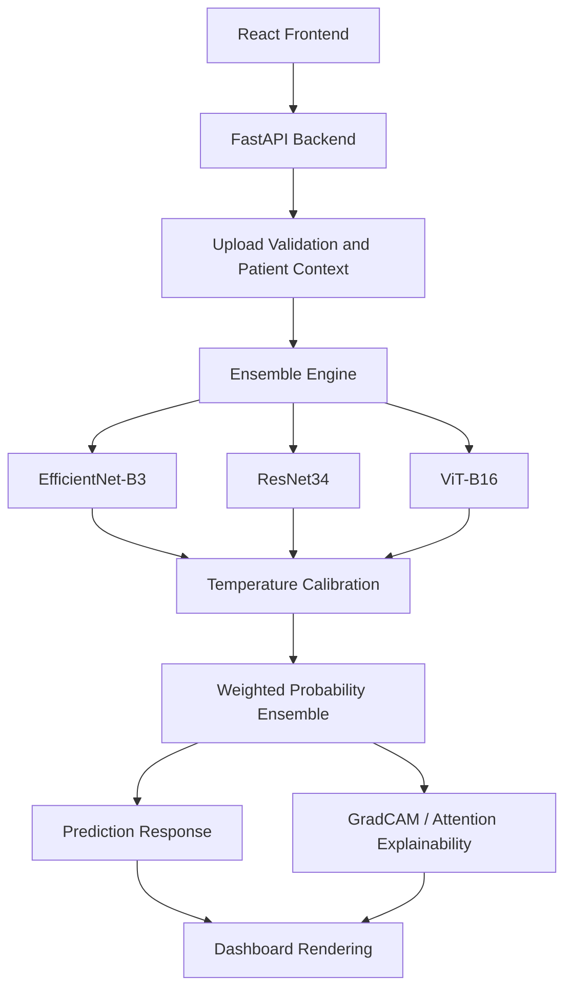

# RetinaRisk Retinal Image Prediction

RetinaRisk is a full-stack retinal image screening system for academic demonstration and portfolio presentation. It classifies retinal fundus images into `Normal`, `At-Risk`, and `Disease Detected` categories using a calibrated ensemble of EfficientNet-B3, ResNet34, and ViT-B16 models. The system includes a FastAPI backend, React frontend, model registry, prediction history, GradCAM explainability, and health/model metadata endpoints.

This project is a clinical decision-support prototype. It is not a standalone diagnosis system.

## 1. Project Overview

The project combines deep learning inference with a practical web workflow:

- Upload or capture a retinal image.
- Run ensemble inference from the current `outputs/` production artifacts.
- Return class probabilities, confidence, agreement, and GradCAM visualization.
- Store patient and prediction history for review.
- Present results in a clinician-facing dashboard.

## 2. Problem Statement

Manual retinal screening can be time-consuming and requires specialist interpretation. This project explores whether deep learning models can support early triage by classifying retinal fundus images into clinically useful severity bands while keeping patient-level data leakage under control during model development.

## 3. Features

- Patient-safe train/validation/test split.
- Production registry for model checkpoints and metrics.
- EfficientNet-B3, ResNet34, ViT-B16, and excluded baseline Custom CNN.
- Weighted ensemble inference.
- Temperature calibration per model.
- Probability normalization and model agreement reporting.
- GradCAM and ViT attention explainability support.
- FastAPI endpoints for health, metadata, prediction, GradCAM, patients, and reports.
- React dashboard with upload, prediction rendering, confidence display, history, analytics, and error handling.

## 4. Architecture Diagram



## 5. Dataset Description

The dataset is organized into retinal severity classes:

- `Normal`
- `At-Risk`
- `Disease Detected`

The project includes patient-safe split artifacts in `research_patient_safe_aug_dataset/`, including split summaries and leakage audit files. The production inference artifacts are stored in `outputs/`.

## 6. Data Pipeline

1. Source retinal images and labels are prepared into structured CSV files.
2. Patient-level identifiers are used to avoid leakage across train, validation, and test splits.
3. Images are resized and normalized for ImageNet-style model backbones.
4. Optional augmentation is used during model development.
5. Final production inference reads only from `outputs/` checkpoints and histories.

## 7. Models Used

- EfficientNet-B3: active ensemble member.
- ResNet34: active ensemble member.
- ViT-B16: active ensemble member.
- Custom CNN: retained in registry for transparency, excluded from production ensemble with zero weight.

## 8. Ensemble Strategy

The production ensemble uses fixed normalized weights:

- EfficientNet-B3: `0.358974`
- ResNet34: `0.358974`
- ViT-B16: `0.282051`
- Custom CNN: `0.000000`

Each model output is temperature-calibrated, converted to probabilities with softmax, normalized, and then combined by weighted averaging. The final probability vector is normalized again before selecting the predicted class.

## 9. GradCAM Explainability

For CNN-style backbones, GradCAM highlights image regions contributing to the selected prediction. For ViT, attention rollout is attempted when attention maps are available. The backend stores generated explainability images under `outputs/gradcam/` and exposes them through `/gradcam/{prediction_id}`.

## 10. Results Table

Latest validation metrics from `outputs/*_history.json`:

| Model | Accuracy | Weighted F1 | Macro F1 | ROC-AUC |
| ----- | -------- | ----------- | -------- | ------- |
| EfficientNet-B3 | 0.8257 | 0.8190 | 0.8084 | 0.9288 |
| ResNet34 | 0.8212 | 0.8174 | 0.8079 | 0.9220 |
| ViT-B16 | 0.8220 | 0.8199 | 0.8069 | 0.9097 |
| Custom CNN | 0.7586 | 0.7437 | 0.7231 | 0.8791 |

| Model | Parameters | Role |
| ----- | ---------- | ---- |
| EfficientNet-B3 | 10,700,843 | Active ensemble classifier |
| ResNet34 | 21,286,211 | Active ensemble classifier |
| ViT-B16 | 85,800,963 | Active ensemble classifier |
| Custom CNN | 422,659 | Baseline retained in registry, excluded from ensemble |

## 11. API Documentation

Core public/system endpoints:

| Method | Endpoint | Purpose |
| ------ | -------- | ------- |
| `GET` | `/health` | Backend readiness and loaded model status |
| `GET` | `/model-info` | Production registry, weights, active checkpoints |
| `POST` | `/auth/register` | Create a user |
| `POST` | `/auth/login` | Authenticate and receive a bearer token |
| `GET` | `/patients` | List patients |
| `POST` | `/patients` | Create a patient |
| `POST` | `/predict` | Upload image and run prediction |
| `GET` | `/gradcam/{prediction_id}` | Return stored GradCAM image |
| `GET` | `/models` | List synced model metadata |
| `POST` | `/models/sync` | Sync registry metadata into the database |

Example prediction request:

```bash
curl -X POST http://127.0.0.1:8001/predict \
  -H "Authorization: Bearer <token>" \
  -F "patient_id=1" \
  -F "image=@sample_retina.jpg"
```

## 12. Installation

Use Python 3.9+ and Node.js 20+.

```bash
python -m venv .venv
.venv\Scripts\activate
pip install -r requirements.txt

cd frontend
npm install
```

## 13. Running Backend

From the project root:

```bash
python -m uvicorn api.app:app --host 127.0.0.1 --port 8001 --reload
```

Recommended production/demo environment variables:

```bash
set JWT_SECRET=<32-plus-character-secret>
set CORS_ORIGINS=http://127.0.0.1:5173,http://localhost:5173
set RETINAL_REJECTION_ENABLED=1
```

## 14. Running Frontend

From `frontend/`:

```bash
npm run dev
```

Open `http://127.0.0.1:5173`. If the backend is on a different URL, set:

```bash
set VITE_API_BASE=http://127.0.0.1:8001
```

## 15. Example Screenshots

Repository visual artifacts:

- `outputs/efficientnet_confusion_matrix.png`
- `outputs/resnet_confusion_matrix.png`
- `outputs/vit_confusion_matrix.png`
- `outputs/gradcam/` for generated GradCAM examples after inference

For a final portfolio README, add dashboard screenshots under a `docs/screenshots/` folder and link them here.

## 16. Future Improvements

- Add a dedicated test suite with isolated temporary databases.
- Add Docker Compose for reproducible demo deployment.
- Add CI checks for backend import, frontend lint/build, and registry validation.
- Add model cards with dataset limitations and subgroup evaluation.
- Add secure production storage for uploaded images and generated explanations.
